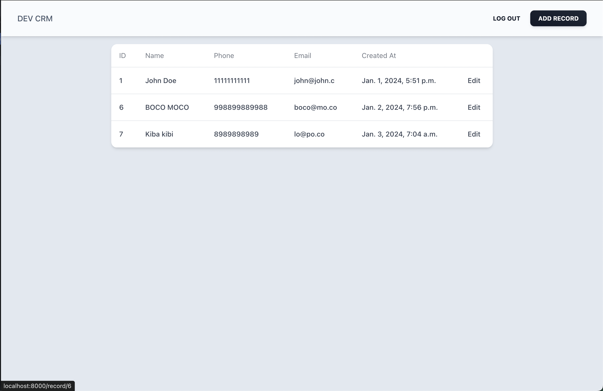
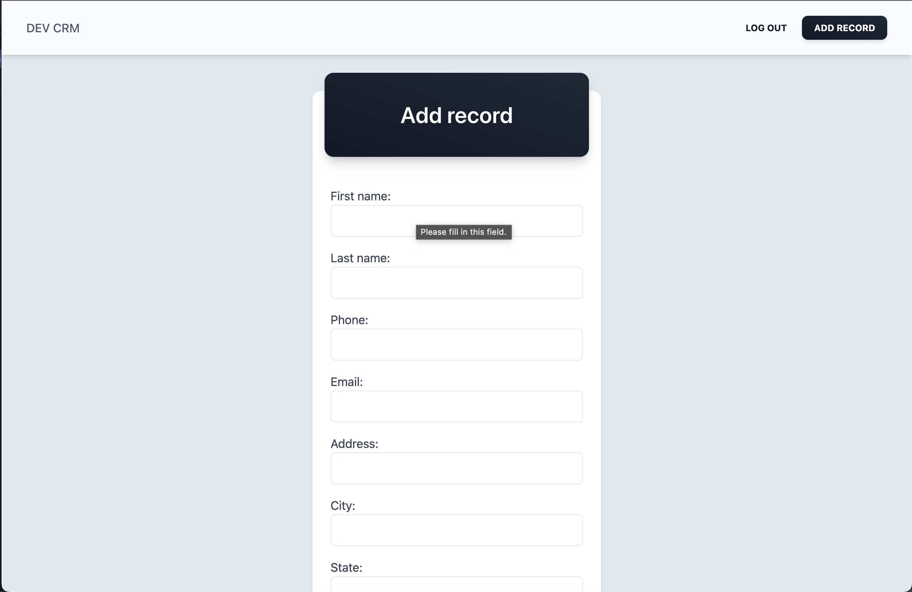
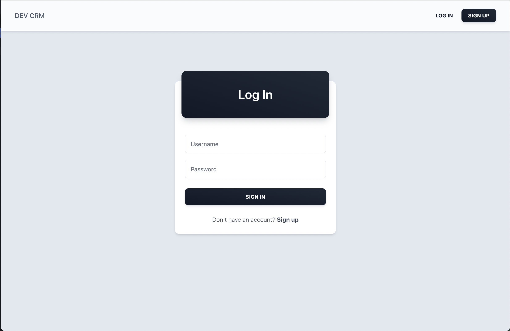
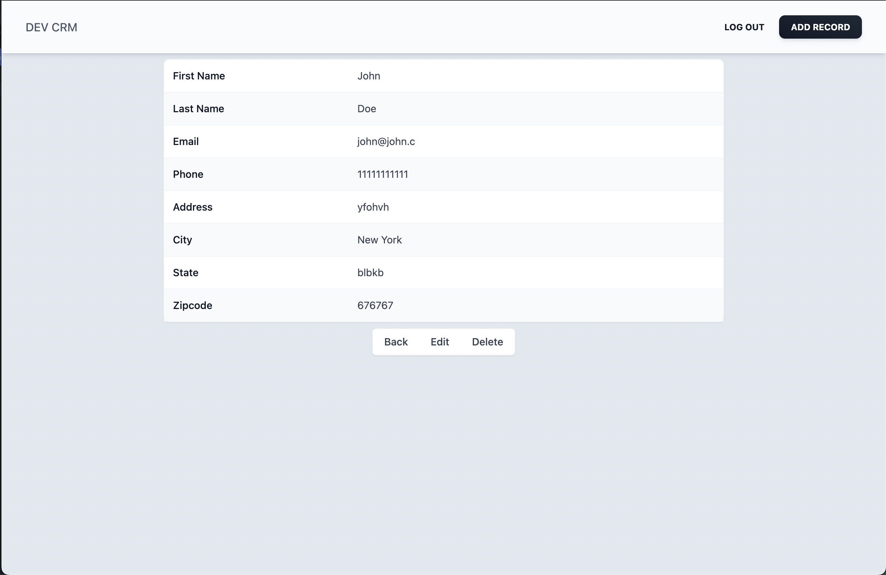

# Django CRM app
CRM app built with Django and sqlite as database.
Tailwindcss used for styling







Features : 
- register user
- login user
- add records
- update records
- delete records

## Run the app
### 1. Create an environment
Using conda : 
```shell
conda create --name django-crm python=3.9
```

### 2. Install dependencies
```shell
pip install -r requirements.txt
```

### 3. Run development server
```shell
python run manage.py runserver
```

## Useful django commands : 
- python manage.py startapp \<app> : create a new app
- python manage.py createsuperuser : create a new admin
- python manage.py make migrations : create new migrations based on changes in models
- python manage.py migrate : apply and unapply migrations
- python manage.py runserver : run development server